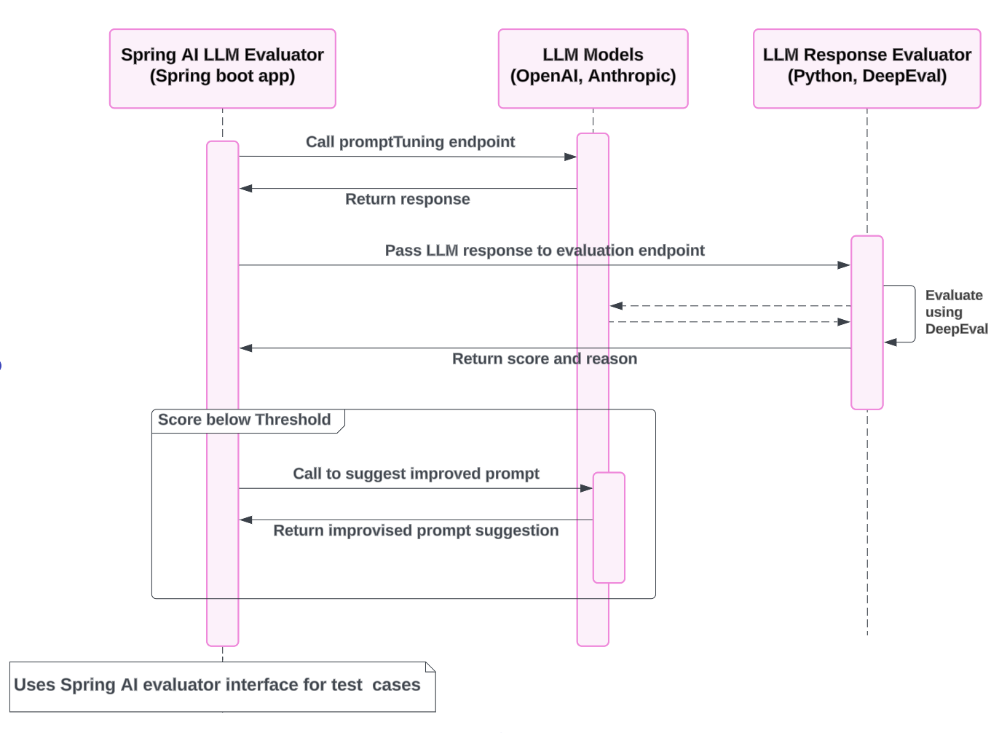

# Spring AI LLM Demo

## Overview

This demo project explores the integration of Spring AI with LLMs (Large Language Models) to generate code snippets and evaluate LLM responses. By using tools like the DeepEval evaluation framework, we can score and fine-tune model responses for quality and relevance.

## Project Components

1. **spring-ai-llm-evaluator**: A Spring Boot application that serves as the core of the project. It provides endpoints for generating code snippets based on predefined or custom prompts. It supports integration with models like OpenAI and Anthropic.

2. **llm-response-evaluator**: A Python-based evaluation service that uses DeepEval to evaluate the quality and relevance of LLM responses. This service runs as a Docker container and is called by the Spring Boot application to evaluate LLM responses.

3. **spring ai evaluator**: The Spring AI project provides an Evaluator API that can be used to write test cases within the Spring Boot application itself, offering an alternative to Python-based frameworks. This allows evaluation of model responses directly in the Spring ecosystem, and the tests demonstrate how Spring AI can be used to evaluate LLM responses.

## How It Works

Code Generation: The Spring Boot application (spring-ai-llm-evaluator) listens for requests to the `/promptTuning` endpoint and interacts with selected LLM (e.g., OpenAI or Anthropic) to generate code snippets or responses based on the provided prompts.

Response Evaluation: The generated response is sent to the llm-response-evaluator service, which uses the DeepEval framework to assess the quality of the response using metrics like G-Eval.

Prompt Tuning: If the response quality is below a threshold, we call the LLM again to improve the prompt to produce better results that satisfy the evaluation criteria. 

## Running the Project

1. Spring AI LLM Evaluator: Follow the [instructions](https://github.com/vudayani/spring-ai-llm-demo/blob/main/spring-ai-llm-evaluator/README.md) in the spring-ai-llm-evaluator repository to set up and run the Spring Boot application.

2. LLM Response Evaluator: Set up the Python-based DeepEval service by following the [instructions](https://github.com/vudayani/spring-ai-llm-demo/blob/main/llm-response-evaluator/README.md) in the llm-response-evaluator repository.

3. Integration: Once both services are running, you can use the endpoints for code generation and prompt tuning.