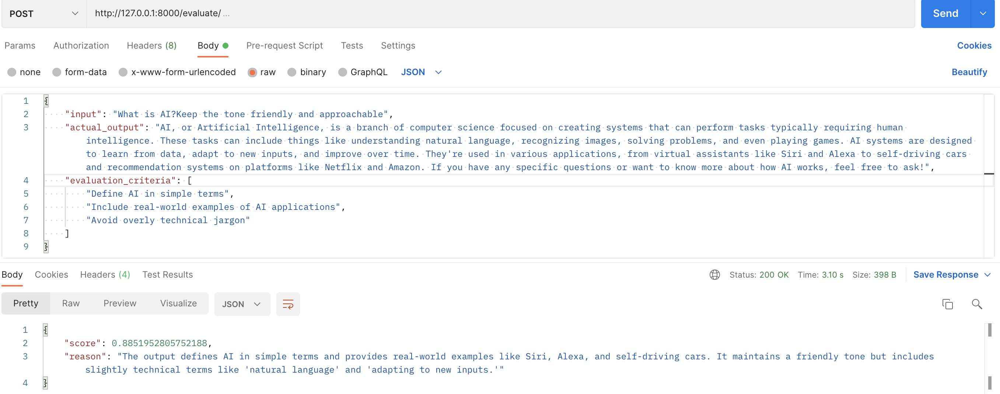

# Deepeval for Evaluating LLM Responses

This project leverages [Deepeval](https://github.com/confident-ai/deepeval) to write tests and evaluate the responses of LLMs, focusing on accuracy and relevance. It is designed to assess how well the different language models interpret various prompts, helping users refine prompts and improve response quality.

The project includes tests that evaluate responses using metrics such as **G-Eval** and **Answer Relevancy**. Additionally, the application can be deployed as a Docker container, exposing an `/evaluate` endpoint which uses G-Eval metric for evaluation and outputs a score indicating the accuracy of the responses.

## Getting Started

To get started, clone the repository to your local machine:

```bash
git clone https://github.com/vudayani/spring-ai-llm-demo.git
cd llm-response-evaluator
```

## Prerequisites

Ensure the following are installed on your system before running the tests:

- Python 3.8 or higher. If not installed, you can download it from [here](https://www.python.org/downloads/).
- Pip (Python package installer)
- Deepeval package: Install it using pip `pip install -U deepeval`
- Docker for running the service in a containerized environment

## Running as a Docker Service

The `/evaluate` endpoint allows you to evaluate LLM responses by sending a POST request with the necessary data. The endpoint processes the input, actual output, retrieval context, and evaluation criteria to provide a score and reason for the evaluation. It uses the G-Eval Metric to generate a score and reasoning.

You can run the application as a Docker service:

1. Build the Docker image:

```bash
docker build -t evaluation-service .
```

1. Run the Docker container, exposing it on port 8000 and setting the necessary environment variable:

```bash
docker run -p 8000:8000 -e <OPENAI_API_KEY> evaluation-service
```
Replace <OPENAI_API_KEY> with your OpenAI API key to enable LLM evaluation.

**Note**: Deepeval's metrics utilize LLMs for evaluation. In this project, OpenAI GPT models are used.

Once running, the service is accessible at http://localhost:8000, ready to evaluate LLM responses through the exposed endpoint.

## Endpoint Details

The /evaluate endpoint accepts a POST request with the following JSON payload:
```bash
{
    "input": "Your input prompt",
    "actual_output": "The actual output from the LLM",
    "context": "Additional context (optional)",
    "retrieval_context": ["Relevant context 1", "Relevant context 2"] (optional),
    "evaluation_criteria": ["Criterion 1", "Criterion 2"]
}
```



The endpoint uses the G-Eval metric to evaluate the LLM response based on the provided criteria and returns a score and reason for the evaluation.

## Running the Tests

Deepeval offers a range of default metrics for you to quickly get started with. This project includes two example tests using G-Eval Metric and Answer Relevancy Metric.

To run individual tests, execute the following command:

```bash
cd tests
deepeval test run test_g_eval_metric.py
deepeval test run test_answer_relevancy.py
```

**Note**: To learn more about G-Eval or other metrics, refer the documentation [here](https://docs.confident-ai.com/docs/metrics-llm-evals)
