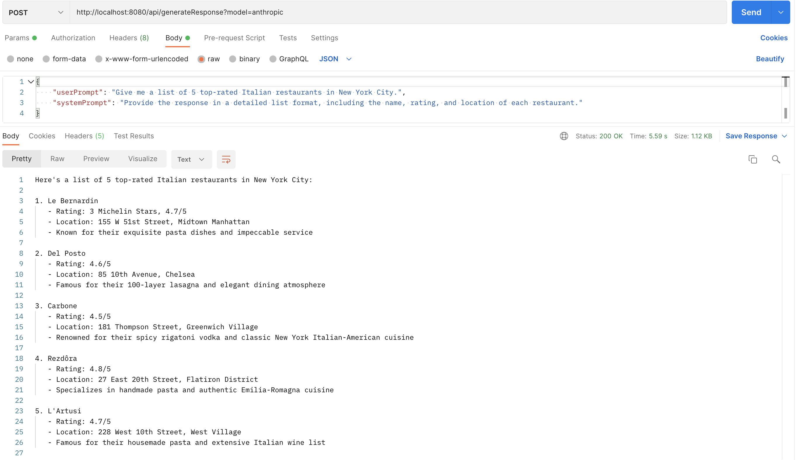
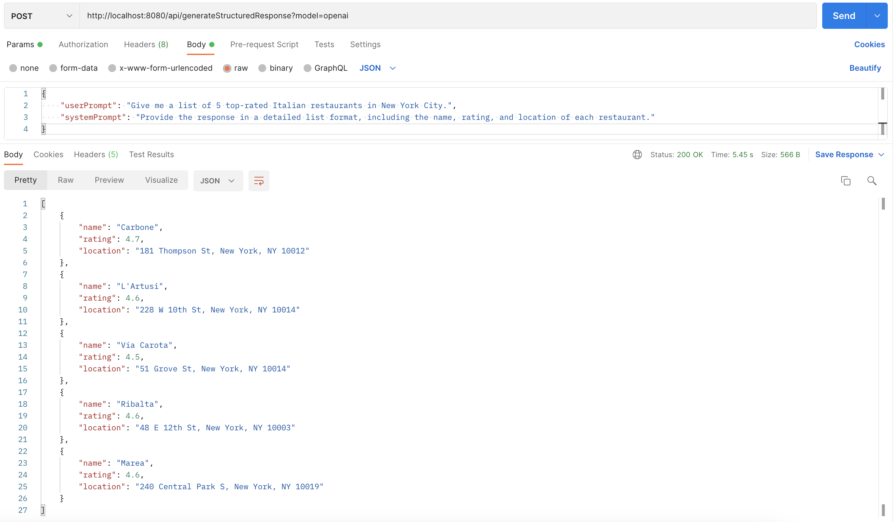

# Exploring Spring AI: Simplifying LLM Integration for Java Developers

In this three-part blog post, we will explore Spring AI and its seamless integration with large language models (LLMs). We’ll start with an introduction to Spring AI and its capabilities, followed by a dive into DeepEval, a Python-based framework for evaluating LLM responses. Finally, we’ll bring it all together with an example that combines the power of Spring AI with DeepEval, showing how to create prompt-tuning endpoint and automate LLM evaluation workflows.

## Introduction

Large Language Models (LLMs) have revolutionized the way we interact with AI for tasks like code generation, summarization, and question answering. While Python frameworks dominate the landscape for building AI-powered applications, Spring AI emerges as a powerful option for Java developers, abstracting the complexities of working with LLMs.

In this article, I will introduce Spring AI, show you how to get started with it, and demonstrate its flexibility in interacting with various LLM providers. Whether you're a seasoned Java developer or new to AI, Spring AI makes it easy to leverage the power of LLMs.

## Spring AI

Spring AI excels because of its simplicity and flexibility. With minimal setup, you can connect to multiple LLM providers, switch between them effortlessly, and scale your application as needed.

Much like Spring Data abstracts data access layers, Spring AI provides a seamless way to interact with popular LLMs like OpenAI, Azure OpenAI, Google Gemini, and more. You write your code once, and Spring AI injects the required beans and configurations dynamically, enabling developers to focus on building applications instead of managing complex integrations.

There are multitude of models available these days, but for this demo, I have used OpenAI and Anthropic.

## Getting Started with Spring AI 

Integrating Spring AI into your application involves three simple steps:

1. **Adding Dependencies**
Include the necessary dependencies in your `pom.xml` for the LLM providers you intend to use:
```xml
    <dependency>
      <groupId>org.springframework.ai</groupId>
      <artifactId>spring-ai-azure-openai-spring-boot-starter</artifactId>
	  </dependency>
    <dependency>
		<groupId>org.springframework.ai</groupId>
		<artifactId>spring-ai-anthropic-spring-boot-starter</artifactId>
	</dependency>
```

2. **Configuring Properties**
Define the necessary configuration properties in your `application.yaml` file. You need to fetch the API keys for the LLM providers you intend to use and configure the model names accordingly. This ensures that Spring AI can authenticate and interact with the respective LLM services seamlessly.

```yaml
spring:
  ai:
    #OpenAI parameters
    openai:
      api-key: ${OPENAI_API_KEY}
      chat:
        options:
           model: "gpt-4o"
    #Anthropic parameters
    anthropic:
      api-key: ${ANTHROPIC_API_KEY}
      chat:
        options:
           model: "claude-3-5-sonnet-20241022"
```

3. **Define Chat Clients**
Lets see how to configure and call two different Large Language Models (OpenAI, Anthropic) using Spring AI.
Define two ChatClient beans, one for each LLM provider:
```java
    @Bean
    public ChatClient openAIChatClient(OpenAiChatModel chatModel) {
	    return ChatClient.create(chatModel);
    }

	@Bean
	public ChatClient anthropicChatClient(AnthropicChatModel chatModel) {
		return ChatClient.create(chatModel);
	}
```

You can use a factory method to seamlessly switch between different LLMs dynamically. The `chatClientFactory` method `getChatClient` returns the appropriate chat client instance based on the provided model type:

```java
public class ChatClientFactory {

    private final ChatClient openAIChatClient;
    private final ChatClient anthropicChatClient;

    public ChatClientFactory(
            @Qualifier("openAIChatClient") ChatClient openAIChatClient,
            @Qualifier("anthropicChatClient") ChatClient anthropicChatClient) {
        this.openAIChatClient = openAIChatClient;
        this.anthropicChatClient = anthropicChatClient;
    }

    public ChatClient getChatClient(String modelType) {
        if ("openai".equalsIgnoreCase(modelType)) {
            return openAIChatClient;
        } else if ("anthropic".equalsIgnoreCase(modelType)) {
            return anthropicChatClient;
        } else {
            throw new IllegalArgumentException("Invalid model type: " + modelType);
        }
    }
}
```

That's all it takes to get started. You are now ready to interact with LLM models.

## Example: Interacting with Mutliple LLMs

Now that the setup is complete, let's explore Spring AI's capabilities of interacting with multiple LLMs with an example. 

We have a Code Generation Endpoint (`/generateResponse`) that accepts user input and generates a response based on the selected model.
- If no custom prompt is provided, the application uses a default prompt to generate a sample JPA repository code
- When a custom prompt is supplied, the endpoint generates responses tailored to the user's input

Here is the core snippet that interacts with different LLMs:
```java

    ChatClient chatClient = chatClientFactory.getChatClient(model);
    return chatClient.prompt()
                    .system(s -> s.text(promptRequest.systemPrompt()))
                    .user(u -> u.text(promptRequest.userPrompt()))
                    .call()
                    .chatResponse();
```
This snippet of code is enough to interact with multiple LLMs through Spring AI. 
The endpoint takes the user's input prompt and the selected model. The chatClientFactory is used to dynamically fetch the appropriate ChatClient based on the model. The `ChatClient` bean provided by Spring AI manages sending the user text to the LLM and returning the chat response.

#### Example Request and Responses

User Input:
```yaml
{
    "userPrompt": "Give me a list of 5 top-rated Italian restaurants in New York City.",
    "systemPrompt": "Provide the response in a detailed list format, including the name, rating, and location of each restaurant."
}
```

#### Responses from Different Models

- OpenAI Response:


- Anthropic Response:


Behind the scenes, Spring AI ensures that:

- The correct API keys and configurations are applied for the selected model
- A unified interface (ChatClient) is used to handle prompts and fetch responses
- Developers don’t need to worry about the nuances of integrating with different LLM APIs

By abstracting these details, Spring AI empowers developers to focus on building meaningful applications rather than managing complex integrations.

## Handling Unstructured Data
In the above examples, we saw the responses are returned as raw JSON strings. Developers need to manually parse it into a usable structure, such as a POJO (Plain Old Java Object) in Java. This can be error-prone and requires additional code to deserialize the response.

### Spring AI’s OutputParser

The Spring AI Structured Output Converters help to convert the output from LLMs into a structured format. Currently, Spring AI provides AbstractConversionServiceOutputConverter, AbstractMessageOutputConverter, BeanOutputConverter, MapOutputConverter, and ListOutputConverter implementations.

Let see how output converters aid in returning `List<Restaurant>` in the above example.

```java
return chatClient.prompt()
            .system(s -> s.text(promptRequest.systemPrompt()))
            .user(u -> u.text(promptRequest.userPrompt()))
            .call()
            .entity(new ParameterizedTypeReference<List<Restaurant>>() {});
```

By specifying the entity type which internally uses `BeanOutputConverter` to convert the raw response into a structured list of Restaurant objects, making it easy to use in your application.



There you go, the first Spring AI example is ready in a few minutes.

## Conclusion

Spring AI proves to be a powerful framework for integrating LLM capabilities into Java applications. Its simplicity, combined with its support for advanced features, makes it a great choice for both beginners and experts.

In addition to the examples discussed, Spring AI offers a wealth of features like function calling to invoke external APIs, chat memory for retaining context, streaming responses for real-time applications, RAG context for grounded outputs, and native image compatibility for enhanced performance. These capabilities open the door to even more innovative applications, making Spring AI a robust choice for modern AI-driven development.

In the [next article](./deepeval.md), we will explore DeepEval, a Python-based evaluation framework, and demonstrate how it can be integrated with Spring AI to evaluate LLM responses. Stay tuned!

To explore this project in more detail, visit the [GitHub repository](https://github.com/vudayani/spring-ai-llm-demo/tree/main/spring-ai-llm-evaluator).

